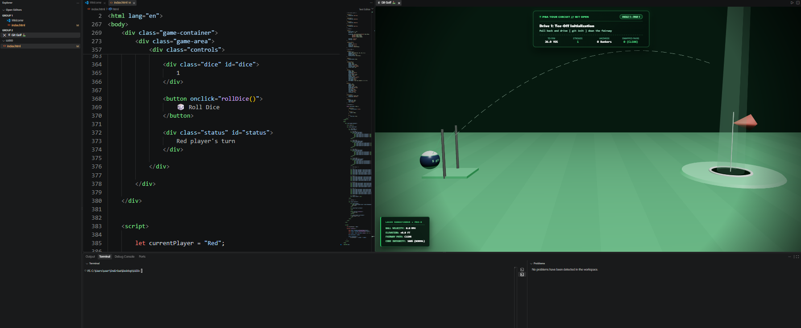
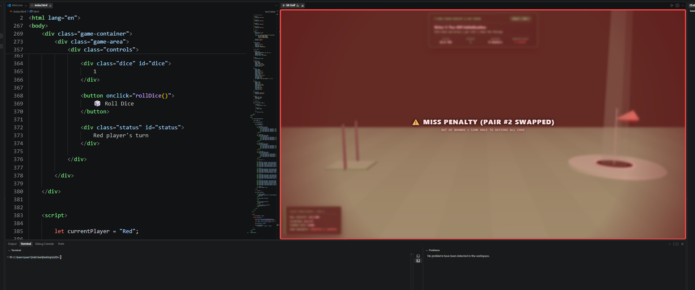
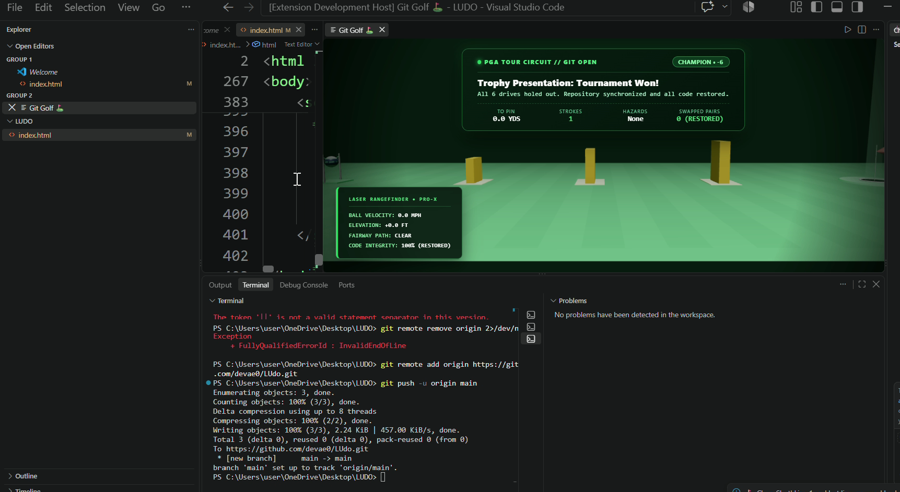

# Git Golf 🎯


## Basic Details
### Team Name: Errors


### Team Members
- Team Lead: Devasangeethi S - Gov Model Engineering College
- Member 2: Annmaria A Arampulickal - Gov Model Engineering College


### Project Description
**Git Golf** is a satirical VS Code extension that turns version control into a high-stakes 3D fairway challenge. Sinking putts automatically executes your Git commands in the terminal to push your repository to GitHub, while missed shots penalize you by swapping lines in your active source code until you make the shot.

### The Problem (that doesn't exist)
Traditional version control is recklessly boring and dangerously safe. Modern developers are coddled by reliable command lines that obediently run git push without requiring an ounce of athletic coordination or risking immediate structural damage to their codebase.

Executing a brief command offers zero adrenaline, zero fairway wind calculations, and worst of all, zero physical consequences for poor aim. The software industry has spent decades making code deployment safe, predictable, and devoid of sand traps, leaving developers entirely unprepared for an environment where committing code could instead disrupt their working tree whenever a drive slices into the rough.

### The Solution (that nobody asked for)
Git Golf fixes developer overconfidence by locking standard Git workflows behind a 3D championship putting green embedded right inside Visual Studio Code.

Version control is now strictly determined by your short game:

- **Putt to Push:** Sinking a putt automatically executes the next command in your integrated terminal, moving your project from git init to git push without typing a single character.

- **Cascading Line Corruption:** Missing the cup, finding a sand trap, or sailing out of bounds immediately punishes your active file. Each miss swaps the outer lines inward, pairing Line 1 with the last line, Line 2 with the second-to-last line, and so on, until your code is pure syntax chaos.

- **Redemption by Accuracy:** No amount of manual debugging can fix the damage; only a good swing can. Sinking a clean putt unwinds every swapped line in reverse order, fully restoring your code before it pushes upstream.

## Technical Details
### Technologies/Components Used
For Software:
- **Languages Used:** JavaScript (ES6+), HTML5, CSS3, Shell / Bash
- **Frameworks Used:** Visual Studio Code Extension API (Node.js runtime environment)
- **Libraries Used:** Three.js (r128 via CDN for 3D WebGL graphics and physics simulation)
- **Tools Used:**
  - Visual Studio Code & VS Code Extension Development Host
  - Git CLI & GitHub
  - Web Audio API (native procedural audio synthesis)
  - VS Code Webview API & Integrated Terminal API
  - Node.js & npm / vsce (for extension packaging and `.vsix` bundling)

### Implementation
For Software:
# Installation
**Option A: Install Packaged Extension (`.vsix`)**
1. Download the `git-golf-1.0.0.vsix` file from the repository.
2. In VS Code, open the Extensions panel (`Ctrl + Shift + X`).
3. Click the **`...`** (Views and More Actions) menu in the top-right corner.
4. Select **Install from VSIX...** and choose the `.vsix` file.

**Option B: From Source (For Developers)**
```bash
git clone [https://github.com/your-username/git-golf.git](https://github.com/devae0/useless_project_dev.git)
cd useless_project_dev
npm install
```

# Run
1. Open the project in VS Code and press **`F5`** to launch the **[Extension Development Host]** window.
2. In the new window, open any project folder containing code files.
3. Open the Command Palette:
   - **Windows / Linux:** `Ctrl + Shift + P`
   - **macOS:** `Cmd + Shift + P`
4. Type and execute:
```text
Git Golf: Play to Push
```

### Project Documentation
For Software:

# Screenshots (Add at least 3)

*Interactive 3D fairway Webview displaying slingshot trajectory aiming, scorecard HUD, and active Git command targeting.*


*Cascading line transposition penalty triggered upon a missed shot, inverting source file lines pair-by-pair.*


*Automated Git command execution in the integrated terminal and full code restoration upon sinking a putt.*

# Diagrams


### Architecture & System Workflow Explanation

The Git Golf extension architecture is divided into two primary execution environments that communicate via asynchronous bidirectional message passing: the **Extension Host (Node.js)** and the **Webview Sandbox (Three.js & Web Audio)**.

#### 1. Extension Host & Command Orchestration
* **Command Registry:** Activates via `Git Golf: Play to Push` from the Command Palette, initializing the lifecycle and allocating the side-by-side Webview panel.
* **Integrated Terminal API:** Directly dispatches the queued Git commands (`git init`, `git add .`, `git commit -m "..."`, and `git push`) to the developer's active workspace terminal upon receiving success events.
* **TextEditor API (Penalty Engine):** Interfaces with the active open document to apply or reverse line transpositions. When a penalty event arrives, it programmatically swaps symmetrical line pairs (e.g., Line 1 with Line $N$) to create immediate syntax errors without manual user intervention.

#### 2. Webview Sandbox (Physics & Presentation)
* **Three.js Simulation (r128):** Renders a 3D fairway with custom elevation, cup collision detection, and slingshot launch mechanics calculated using elasticity and gravity vectors.
* **Web Audio API:** Synthesizes procedural audio feedback (slingshot pullback tension, fairway rolls, hazard splashes, and sinking chimes) entirely in-memory without external media assets.
* **Webview Bridge (`acquireVsCodeApi`):** Sends postMessage payloads to the host containing state updates:
  * **Success Path (Green):** Dispatches next command to the terminal and restores any swapped lines.
  * **Miss/Hazard Path (Red):** Transmits penalty triggers to initiate cascading line corruption.

#### 3. State Management & Lifecycle
* Tracks current hole difficulty, stroke counts, and active Git stage progression (`Init` $\rightarrow$ `Add` $\rightarrow$ `Commit` $\rightarrow$ `Push`).
* Codebase restoration strictly depends on sinking the subsequent shot, which pops the transposition history stack in reverse order and returns the active editor buffer to its original working state before pushing upstream.

## Lifecycle Workflow
```mermaid
flowchart TD
    A[Launch Git Golf: Play to Push] --> B[VS Code Extension Host]
    B --> C[Open Three.js Webview Fairway]
    
    subgraph Webview [Webview Sandbox]
        C --> D[Slingshot Aim & Launch Physics]
        D --> E{Shot Outcome}
        E -->|Miss / Hazard| F[Send Miss Penalty Event]
        E -->|Sink Cup| G[Send Success Event]
    end

    subgraph Host [VS Code Host Environment]
        F -->|Message API Bridge| H[TextEditor API]
        H --> I[Apply Cascading Line Transposition]
        I --> D

        G -->|Message API Bridge| J[TextEditor API: Revert Swaps]
        J --> K[Terminal API: Dispatch Next Git CLI Command]
    end

    K --> L{Lifecycle Stage}
    L -->|More Stages| C
    L -->|git push Completed| M[Deployment Successful]
 ```


### Project Demo
# Video
[](https://drive.google.com/file/d/1Gs5Z2Rh2xg5ESJPlXd7cNGpJEPMpZkqP/view?usp=sharing)

*A full walkthrough demonstrating the 3D slingshot putting mechanic, real-time cascading line swaps on missed strokes, and automatic terminal execution from `git init` to `git push` upon sinking the cup.*


## Team Contributions
- DEVASANGEETHI S: - Designed the core system architecture, extension lifecycle, and asynchronous host-to-webview communication bridge.
  - Implemented the cascading line transposition penalty system using the VS Code `TextEditor` API to programmatically swap code lines upon missed shots.
  - Built the terminal command orchestration engine to sequentially trigger `git init`, `git add`, `git commit`, and `git push` in the user's active terminal.
  - Engineered the state management and redemption logic to safely restore original source code upon successful putts.
  - Handled extension configuration, packaging (`.vsix`), Git repository management, and technical documentation.

- ANNMARIA A ARAMPULICKAL: - Designed and rendered the 3D fairway environment, course layout, and visual materials using Three.js.
  - Implemented the slingshot drag-and-aim mechanics along with the cup collision physics.
  - Developed procedural sound effects using the Web Audio API for interactive swing, ball roll, and penalty audio feedback.
  - Structured the Webview UI overlay, including scorecard tracking and shot telemetry displays.

---
Made with ❤️ at TinkerHub Useless Projects
